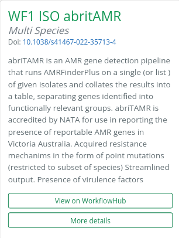
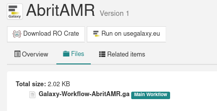
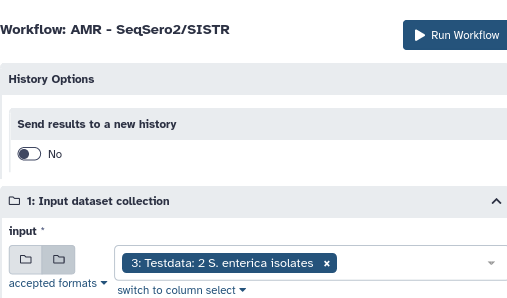

# benchAMRking
BenchAMRking is a platform where users can access and explore a range of best-practice tools, workflows and data for the prediction of AMR genes from WGS data. The workflows have been implemented in Galaxy to facilitate easy access and use of AMR gene prediction bioinformatics tools for researchers. BenchAMRking workflows are free with supporting self-learning training material.

# Run workflow on Galaxy.
First, create an account on [EU galaxy](https://usegalaxy.eu/login/start?redirect=None) and log in.

The workflows are available on [WorkflowHub](https://workflowhub.eu). The main page contains links to the WorkflowHub repository for each workflow:  
  
Navigate to "View on WorkflowHub" toe view the workflow repository.

Importing the run into galaxy can be done by navigating to "Run on usegalaxy.eu". Or import the workflow to a private galaxy instance by using the '*.ga' file to import the workflow.  

Workflow 2 is available on the [Sciensano galaxy instance](https://galaxy.sciensano.be/root?tool_id=pipeline_stec_1.0).

Upload the reads to the galaxy instance.  

Select the input data and run the workflow.  

---

# Extra workflow info
## WF2: Sciensano
[doi.org/10.1099/mgen.0.000531](https://doi.org/10.1099/mgen.0.000531)  
The following workflow is available on Sciensano's galaxy instance. The workflow starts from fastq.

Dataset: 137 STEC isolates - [BioProject PRJNA633966](https://www.ncbi.nlm.nih.gov/sra?linkname=bioproject_sra_all&from_uid=633966)  
Assemblies: [STEC isolate assemblies](https://workflowhub.eu/workflows/407/git/1/download/Assemblies/SKESA_assemblies.tar.gz)  

## WF3: CFIA  
[doi.org/10.3389/fmicb.2020.00549](https://doi.org/10.3389/fmicb.2020.00549)  

The workflow is available [here](https://usegalaxy.eu/workflows/trs_import?trs_server=workflowhub.eu&run_form=true&trs_id=407&trs_version=1) and requires FASTQ files as input.
It also requires the ARGannot and ResFinder databases, which can be downloaded from the following links:  
- [ARGannot_r2.fasta](https://workflowhub.eu/workflows/407/git/1/download/SRST2_databases/ARGannot_r2.fasta)  
- [ResFinder.fasta](https://workflowhub.eu/workflows/407/git/1/download/SRST2_databases/ResFinder.fasta)  

The list of SRA accesssions is available [here](https://workflowhub.eu/workflows/407/git/1/raw/Assemblies/CFIA_SRA_Accessions.txt).
Downloading the samples straight to galaxy is possible by using the [NCBI Accession Download](https://usegalaxy.eu/root?tool_id=toolshed.g2.bx.psu.edu/repos/iuc/ncbi_acc_download/ncbi_acc_download/0.2.8+galaxy0) tool.

Dataset: 137 STEC isolates - [BioProject PRJNA633966](https://www.ncbi.nlm.nih.gov/sra?linkname=bioproject_sra_all&from_uid=633966)  
Assemblies: [STEC isolate assemblies](https://workflowhub.eu/workflows/407/git/1/download/Assemblies/SKESA_assemblies.tar.gz)  

## WF4: Staramr
[doi.org/10.1038/s41467-022-35713-4](https://doi.org/10.1038/s41467-022-35713-4)  

Tool url: <https://usegalaxy.eu/root?tool_id=toolshed.g2.bx.psu.edu/repos/iuc/abritamr/abritamr/1.0.14+galaxy1>__
